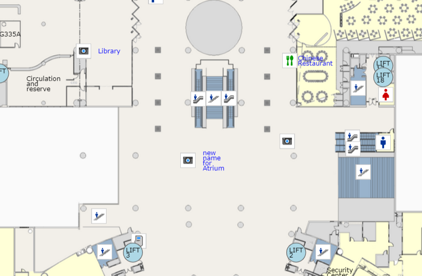

# Plugin types and properties

## Plugin types
There are six types of plugin for this project. They are

- `PrimaryPanelPlugin`
- `MapCanvasPlugin`
- `OverlayHeaderPlugin`
- `OverlayContentPlugin`
- `MobileOverlayHeaderPlugin`
- `MobileOverlayContentPlugin`

They will be rendered in different position of the app and will have access to different properties.

If you want to add any other features in the left panel of the UI, you will need to build a `PrimaryPanelPlugin` type plugin.

If you want to add new features in map canvas area (drag and drop floor plan area), you will need to build a `MapCanvasPlugin` type plugin.

If you click on a map item on the map and if the map item from [`mapItemStore`](typesOfPlugins/README.md#mapItemStore) has `photo`, `url` or `others` properties defined, then `OverlayHeaderPlugin` and `OverlayContentPlugin` or `MobileOverlayHeaderPlugin` and `MobileOverlayContentPlugin` will be be shown on the left hand side panel. `photo`, `url` or `others` will be made available to these plugins as well.

If you want to add new section for map items to be shown on the left UI panel or in the full screen overlay in mobile platform, you will need to build `OverlayHeaderPlugin` and `OverlayContentPlugin` or in mobile platform that would be `MobileOverlayHeaderPlugin` and `MobileOverlayContentPlugin`.

Note that the left UI panel for showing map item details after clicking on them is composed of all `OverlayHeaderPlugin`/`MobileOverlayHeaderPlugin` and `OverlayContentPlugin`/`MobileOverlayContentPlugin` from all plugins. So your `OverlayHeaderPlugin`/ `OverlayContentPlugin` will only add a new section to the panel alongside with other existing content instead of replace all original content.

You may need to build more than one of these plugins to complete your features. You can include more than one of the above plugin types into a single plugin package.


_`OverlayHeaderPlugin` and `OverlayContentPlugin` shown after clicking on Atrium in map area_


_`MobileOverlayHeaderPlugin` and `MobileOverlayContentPlugin` shown after clicking on Library in map area_

## PrimaryPanelPlugin

### Properties

#### x
`x` - number

Current x coordinate of the center of the map canvas.

This x value does not change when user is moving the map until the user releases the mouse click.
If you want a dynamic value, see property with `moving` prefix like `movingX`.

#### y
`y` - number

Current y coordinate of the center of the map canvas.

This y value does not change when user is moving the map until the user releases the mouse click.
If you want a dynamic value, see property with `moving` prefix like `movingY`.


#### level
`level` - number

Current zoom level. 0 is the default zoom level at largest scale.

#### floor
`floor` - string

Current floor ID.

#### search
`search` - boolean

Whether user has requested a search action

#### from
`from` - object

The "from" input field data in the following format:

When room id is given:
```typescript
type From = {
  name: string; /* Display name of the search object */
  data: {
    id: string; /* Id of the search object */
    floor: string; /* Floor of the search object */
    value: string; /* Value of the search object */
    type: "id"; /* Must be "id" when id property is defined */
    coordinates: [
      number, /* x coordinate of the search object */
      number  /* y coordinate of the search object */
    ];
  }
}
```

When only keyword is given:
```typescript
type From = {
  name: string; /* Display name of the search object */
  data: {
    type: 'keyword';  /* Search object type */
    value: string; /* Value of the search object, same as display name for keyword search object type */
  }
}
```

When search nearest item is selected:
```typescript
type From ={
  name: string; /* Display name of the search object */
  data: {
    type: 'nearest'; /* Search object type */
    value: 'lift'|'male toilet'|'female toilet'|'express station'
           |'drinking fountain'|'ATM'|'mailbox'|'restaurant'
           |'virtual barn station'|'satellite printer'; /* Nearest object type to be searched */
  }
}
```

#### to
`to` - object

The "to" input field data. Same format as `from` property.


#### via
`via` - array

An array of places the path required to visit. Represent input field data between `from` and `to` input fields. Array item has the same format as `from` property.


#### linkTo
`linkTo` - function

A function that takes a `{x, y, floor, level, from, to, via, search}` object for the first argument and it will reposition the map canvas to this position and fill the input field with the `from`, `to` and `via` values and do search action if `search` is set to true. All properties in the object are optional, if they are missing in the supplied object, they will be assigned with current position value. For example, you can call `linkTo` with `{level: 2}` to indicate that you don't want to change the current `x`, `y`, `floor` value but to change only the zoom level and keep the map canvas at the same position. This function will also update the URL to reflect state changes as the changes are not save to any store. This can ensure params in URL is the single source of truth for all the states and users can just save or share the url to recreate the same screen.

Format:
x - number

y - number

level - number

search - boolean

from - Refer to `from` property format

to - Refer to `to` property format


The second argument is a string that can be either `push` or `replace` and the default is `push` if it is not supplied. If `push` is given it will create a visit history in the browser and if `replace` is chosen then it will replace the current history and no new history is created.


#### legendStore
`legendStore` - object

An object storing all legend types available for map items
```typescript
type LegendStore = {
  loading: boolean; /* Indicate if legends are loading or not */
  failure: boolean; /* Indicate if legends failed to load */
  success: boolean; /* Indicate if legends are loaded successfully */
  legendIds: string[]; /* An array of legendIds in string */
  legends: { /* An object of legend data with legendId as keys */
    [legendId: string]: {
      name: string; /* Name of the legend */
      image: string;  /* url of the legend image */
    };
  };
}
```

#### mapItemStore
`mapItemStore` - object

An object storing map items with in the currently viewport.

```typescript
type MapItemStore = {
  loading: boolean; /* Indicate if map items are loading or not */
  failure: boolean; /* Indicate if map items failed to load */
  success: boolean; /* Indicate if map items are loaded successfully */
  mapItems: {
    name?: string; /* Name of the map item */
    floor: string; /* Floor id of the map item */
    coordinates: [
      number, /* coordinate x of the map item */
      number  /* coordinate y of the map item */
    ];
    id: string; /* id of the map item */
    connectorId?: string; /* connector id of the map item */
    type?: string; /* map item type */
    photo: string | null; /* photo url of the map item */
    url?: string; /* url of the map item */
    geoLocs?: object; /* a geoJSON object describing the node if it is a room */
    others?: object /* extra information attached to this node by external sources */
  }[]; /* An array of map items object */
}
```

#### floorStore
`floorStore` - object

An object storing the all the floor and building data.

```typescript
type FloorStore = {
  loading: boolean; /* Indicate if floors are loading or not */
  failure: boolean; /* Indicate if floors failed to load */
  success: boolean; /* Indicate if floors are loaded successfully */
  floors: { /* An object of the floor data with floorId as keys */
    [floorId: string]: {
      name: string; /* Name of the floor */
      buildingId: string; /* Id of building of the floor belongs to */
      meterPerPixel: number; /* Meter per pixel of this floor's map */
      mapWidth: number; /* Width of the map of this floor */
      mapHeight: number; /* Height of the map of this floor */
      ratio: number; /* Ratio of the map to the mini map of this floor */
      defaultX: number; /* Default x position for this floor */
      defaultY: number; /* Default y position for this floor */
      defaultLevel: number; /* Default level for this floor */
      startX: number; /* The start coordinate x for this floor, end coordinate will be startX + mapWidth */
      startY: number; /* The start coordinate y for this floor, end coordinate will be startY + mapHeight */
    }
  };
  buildingIds: string[]; /* An array of all available building ids */
  buildings: { /* An object of the building data with buildingId as keys */
    [buildingId: string]: {
      name: string; /* Name of the building */
      floorIds: string[]; /* An array of floor ids of the building */
    }
  };
}
```

#### searchNearestStore
`searchNearestStore` - object

An object storing the search nearest item result.

```typescript
type SearchNearestStore = {
  loading: boolean; /* Indicate if the nearest search result are loading or not */
  failure: boolean; /* Indicate if the nearest search result failed to load */
  success: boolean; /* Indicate if the nearest search result are loaded successfully */
  from: { /* Start location from the nearest item */
    coordinates: [
      number, /* x coordinate of the start location */
      number  /* y coordinate of the start location */
    ];
    type: string | null; /* Type of the start location */
    name: string; /* Name of the start location */
    id: string; /* Id of the start location */
    floor: string; /* Floor id of the start location */
  };
  nearest: {
    coordinates: [
      number, /* x coordinate of the nearest item */
      number  /* y coordinate of the nearest item */
    ];
    type: string; /* Type of the nearest item */
    name: string; /* Name of the nearest item */
    id: string; /* Id of the nearest item */
    floor: string; /* Floor id of the nearest item */
  };
}
```

#### searchShortestPathStore
`searchShortestPathStore` - object

An object storing the shortest path between two locations.

```typescript
type SearchShortestPathStore = {
  loading: boolean; /* Indicate if the shortest path search result are loading or not */
  failure: boolean; /* Indicate if the shortest path search result failed to load */
  success: boolean; /* Indicate if the shortest path search result are loaded successfully */
  paths: {
    floor: string; /* Floor of the node */
    coordinates: [
      number, /* x coordinate of the node */
      number  /* y coordinate of the node */
    ];
    nodeId: string; /* Id of the node */
    distance: number; /* Distance from previous node */
    id: string | null; /*  Map item id of the node, if the node is a map item */
    name: string | null; /*  Map item name if the node is a map item */
    type: string | null; /*  Map item type if the node is a map item */
    photo: string | null; /*  Map item photo url if the node is a map item */
  }[] /* An array of nodes of the shortest point */
}
```

#### searchOptionsStore
`searchOptionsStore` - object

An object storing the user search options

```typescript
type SearchOptionsStore = {
  sameFloor: boolean; /* Whether the nearest object should be on the same floor, only for nearest search */
  noStairCase: boolean; /* Whether the shortest path should include stair case */
  noEscalator: boolean; /* Whether the shortest path should include escalator */
  searchMode: "SHORTEST_TIME"|"SHORTEST_DISTANCE"|"MIN_NO_OF_LIFTS"; /* Shortest path search mode */
  actionSource: "EXTERNAL_LINK"|"BUTTON_CLICK"|"DRAG_AND_DROP"|"CONTEXT_MENU"; /* where the search action are initiated from an external link or a button click in the app */
}
```

#### searchMapItemStore
`searchMapItemStore` - object

An object storing the list the map items searched by keyword

```typescript
type SearchMapItemStore = {
  loading: boolean; /* Indicate if the search result are loading or not */
  failure: boolean; /* Indicate if the search result failed to load */
  success: boolean; /* Indicate if the search result are loaded successfully */
  suggestions: {
    name: string; /* Name of the map item */
    floor: string; /* Floor id of the map item */
    coordinates: [
      number, /* x coordinate of the map item */
      number  /* y coordinate of the map item */
    ];
    id: string; /* Id of the map item */
    type: string | null; /* Type of the map item */
  }[]; /* An array of map item objects */
}
```

#### appSettingStore
`appSettingStore` - object

An object storing app settings.

```typescript
type AppSettingStore = {
  loading: boolean; /* Indicate if app settings are loading or not */
  failure: boolean; /* Indicate if app settings failed to load */
  success: boolean; /* Indicate if app settings are loaded successfully */
  levelToScale: number[]; /* An array of scales available */
  meterPerPixel: number; /* Meter per pixel ratio of the map */
  minutesPerMeter: number; /* Minutes per meter ratio */
  defaultPosition: { /* Default position to jump to when the user enter the index page */
    floor: string; /* Floor Id of the default position */
    x: number; /* x coordinate of the default position */
    y: number; /* y coordinate of the default position */
    level: number; /* Level of the default position */
  };
}
```

#### nearestMapItemStore
`nearestMapItemStore` - object

An object storing the result after calling [`getNearestMapItemHandler`](typesOfPlugins/README.md#getNearestMapItemHandler)

```typescript
type NearestMapItemStore = {
  loading: boolean; /* Indicate if action for requesting a nearest item is still in process or not  */
  failure: boolean; /* Indicate if action for requesting a nearest item failed or not */
  success: boolean; /* Indicate if action for requesting a nearest item succeed or not */
  mapItem: {
    id: string; /* id of the map item */
    name: string; /* name of the map item */
    floor: string; /* floor of the map item */
    coordinates: [number, number]; /* coordinates of the map item */
  };
}
```

#### edgeStore
`edgeStore` - object

An object storing edge items (all possible walking paths) with in the currently viewport.

```typescript
type EdgeStore = {
  loading: boolean; /* Indicate if edges are loading or not */
  failure: boolean; /* Indicate if edges failed to load */
  success: boolean; /* Indicate if edges are loaded successfully */
  edges: {
    id: string; /* Id of the edge */
    fromNodeId: string; /* Starting node id of the edge */
    toNodeId: string; /* Ending node id of the edge */
    weightType: 'nodeDistance' | 'max' | 'number'; /* weight type of the edge */
    weight: number; /* actual weight of weightType is number */
    floor: string; /* id of the floor in which the edges are on */
    fromNodeCoordinates: [number, number] /* coordinates [x, y] of the starting node */
    toNodeCoordinates: [number, number] /* coordinates [x, y] of the ending node */
  }[]; /* An array of edge object */
}
```

#### enhanceMapItemsHandler
`enhanceMapItemsHandler(mapItems: MapItemProp[]) - function`

```typescript
type MapItemProp = {
  id: string; /* id of the map item */
  name?: string; /* Name of the map item */
  coordinates?: [
    number, /* coordinate x of the map item */
    number  /* coordinate y of the map item */
  ];
  type?: string; /* map item type */
  photo?: string | null; /* photo url of the map item */
  url?: string; /* url of the map item */
  geoLocs?: object; /* a geoJSON object describing the node if it is a room */
  others?: object /* extra information attached to this node by external sources */
}
```
This function takes an array of map items and then it will update respective map items in `mapItemStore` with provided values. Other components or plugins of the system consuming values in `mapItemStore` will then get the enhanced version of map items instead of the original data.

Provided object values will be merged into the original object values, so you can just provide the properties you wish to update instead of full map item objects. The only required property is `id` which is the map item id to be updated.

It is important that values provided should be an array of map items that conform to the map item schema `MapItemProp` described above which is similar to [mapItemStore.mapItems](typesOfPlugins/README.md#mapItemStore) expect only `id` is the required property.

Example usage:

```javascript
enhanceMapItemsHandler([{
  id: 'tYkl7OmZOcvN',
  name: 'new name for Atrium'
}]);
```


_Change name for Atrium using enhanceMapItemHandler_


#### clearPluginMapItemsHandler
`clearPluginMapItemsHandler` - function

Clear map item data injected by calling `enhanceMapItemsHandler`.


#### getNearestMapItemHandler
`getNearestMapItemHandler(floor: String, coordinates: [number, number])` - function

You can call this function with `floor` and `coordinates` and it will find a map item that is nearest to the given position. The result will be available in [`nearestMapItemStore`](typesOfPlugins/README.md#nearestMapItemStore) once it is ready.

Example usage:
```javascript
getNearestMapItemHandler('LG1', [0,0])
```

#### openOverlayHandler
`openOverlayHandler(name, photo, url, others)` - function

Open an map item overlay in primary panel area, the param pass in here will be accessible by OverlayHeaderPlugin and OverlayContentPlugin.

Parameters:

`name` - string - Name of the map item

`photo` - string - photo url of the map item, if any

`url` - string - website url of the map item, if any

`others` - object - any other custom data

## MapCanvasPlugin

### Inherited

`MapCanvasPlugin` can get all the properties PrimaryPanelPlugin gets, plus the following extra properties:

### Properties

#### platform
`platform` - string

The platform of the user device currently using the app. Useful for UI positioning or future toggling for different platforms. The platform value is set to `DESKTOP` or `PLATFORM`.

#### width
`width` - number

Current map canvas width.

#### height
`height` - number

Current map canvas height.

#### normalizedWidth
`normalizedWidth` - number

`width` divided by current level's scale, (i.e. the width value at default zoom level)

#### normalizedHeight
`normalizedHeight` - number

`height` divided by current level's scale, (i.e. the height value at default zoom level)

#### moving[PropertName]
The below properties prefixed with `moving` (i.e. `movingX`) means the values keep changing while the user is doing drag and drop action while the counterpart property without prefix `moving` (i.e. `x`) represent a value before a user action just started and will be updated until the user has finished the drag and drop action.

#### movingX
`movingX` - number

x coordinate of the center of the map canvas while the user is doing drag and drop action.

#### movingY
`movingY` - number

y coordinate of the center of the map canvas while the user is doing drag and drop action.

#### movingScaledX
`movingScaledX` - number

`movingX` multiply by current level's scale.

#### movingScaledY
`movingScaledY` - number

`movingY` multiply by current level's scale.

#### movingLeftX
`movingLeftX` - number

x coordinate offset on the left of the map canvas reference to `movingX` while the user is doing drag and drop action.

#### movingTopY
`movingTopY` - number

y coordinate offset at the top of the map canvas while the user is doing drag and drop action.

#### movingScreenLeftX
`movingScreenLeftX` - number

Similar to `movingLeftX`, but use `movingScaledX` as reference point.

#### movingScreenTopY
`movingScreenTopY` - number

Similar to `movingTopY`, but use `movingScaledY` as reference point.

#### nextLevel
`nextLevel` - number

Next possible zoom level value that represents a larger scale value. Value Will be the same as `level` if there is no possible next zoom level.

#### previousLevel
`previousLevel` - number

Previous zoom level that represents a smaller scale value. Value will be the same as `level` if there is no possible previous zoom level.

#### getPosition
`getPosition` - function

The getPosition function returns the above positional properties (
  `floor`,
  `width`,
  `height`,
  `normalizedWidth`,
  `normalizedHeight`,
  `movingX`,
  `movingY`,
  `movingScaledX`,
  `movingScaledY`,
  `movingLeftX`,
  `movingTopY`,
  `movingScreenLeftX`,
  `movingScreenTopY`,
  `nextLevel`,
  `previousLevel`,
), the use case for using this function to get these values instead of connecting them directly is that you just want these values at some point (i.e. right after some API calls) and your plugin doesn't need to change immediately in any way when these values are changed. If your plugin need to update its render based on the current position value, you should connect the properties directly instead of using this function otherwise your plugin will not be reactive to position change.

#### APIEndpoint
`APIEndpoint` - function

The function returns the root API endpoint of the system.

#### canvas
`canvas` - HTMLCanvasElement

Canvas DOM element reference

#### addMapTiles
`addMapTiles([mapTile1, mapTile2, ...])` - function

Add a map tile to the map canvas.

It takes an array of map tile objects.

mapTile object

```typescript
type MapTile = {
  id: string; /* Id of the map tile */
  floor: string; /* Floor id for the map tile */,
  x: number; /* x coordinate of the map tile */
  y: number; /* y coordinate of the map tile */
  image: HTMLImageElement; /* Image of the map tile */,
  width:number | null; /* Width of the image or if null is given it will be determined automatically when the image is loaded */
  height:number | null; /* Height of the image or if null is given it will be determined automatically when the image is loaded */
  hidden:boolean; /* Wether the map tile is hidden */
  scalePosition: boolean; /* Should the map item scale it's position when the map scale change */
  scaleDimension: boolean; /* Should the map item scale it's dimension when the map scale change */
}
```

#### setMapItems
`setMapItems([mapItem1, mapItem2, ...])` - function

Add or update a map item on the map canvas.

It takes an array of objects as an argument with the following format:
Note that you can only define one of the following properties in the object

`textElemenet`, `circle`, `rect`, `line`, `image`, `shape`

If you define more than one, only the first encountered one will be taken and the rest will be ignore.
A map item doesn't support multiple types, you should define two map items with different types.

mapItem object:

```typescript
type MapItem = {
  id: string; /* Id of the map item */
  floor: string; /* Floor id for the map item */
  x: number; /* x coordinate of the map item */
  y: number; /* y coordinate of the map item */
  image?: HTMLImageElement; /* Image of the map item */
  width?: number | null; /* Width of the map item or if null is given, it will be determined automatically */
  height?: number | null; /* Height of the map item or if null is given, it will be determined automatically */
  zIndex?: number | null; /* The depth of the map item, when map items overlap each other, the map item with higher zIndex will cover those with lower zIndex, default to 0 */
  center?: boolean; /* The x,y coordinates will be set as a center of the object if set to true */
  hidden?: boolean; /* Wether the map tile is hidden */
  scalePosition?: boolean; /* Should the map item scale it's position when the map scale change */
  scaleDimension?: boolean; /* Should the map item scale it's dimension when the map scale change */
  onClick?: () => void; /* callback function to be called when the map item is clicked */
  onMouseOver?: () => void; /* callback function to be called when the cursor is over the map item */
  onMouseOut?: () => void; /* callback function to be called when the cursor was over the map item and now is out side the map item */
  onMouseMove?: () => void; /* callback function to be called when the cursor is over and moving on the map item */
  onDrag?: () => void; /* callback function to be called when the cursor is dragging the map item */
  onDragEnd?: () => void; /* callback function to be called when the cursor finishes dragging the map item */
  customHitX?: number; /* The custom x coordinate on the left of the map item used in calculating hit test, will use default x coordinate if this is not specified */
  customHitY?: number; /* The custom y coordinate at the top of the map item used in calculating hit test, will use default y coordinate if this is not specified */
  customHitWidth?: number; /* The custom width of the map item used in calculating hit test, will use default width of the map item if this is not specified */
  customHitHeight?: number; /* The custom height of the map item used in calculating hit test, will use default height of the map item if this is not specified */
  others?: {}; /* Any other custom data to be attached to this map item */
  textElement?: {
    style: string; /* Font style of the text in CSS font format*/
    color: string; /* Color the text in CSS format */
    text: string; /* The text message */
    maxLineWidth?: number; /* The max line width allowed in pixel, the text will be wrapped into multiple lines if the width exceeds this number */
  };
  circle?: {
    radius: number; /* Radius of the circle */
    color: string; /* Color of the circle in CSS format */
    borderColor?: string; /* Border color of the circle in CSS format */
  };
  rect?: {
    width: number; /* Width of the rect */
    height: number; /* Height of the rect */
    color: string; /* Color of the rect in CSS format */
    borderColor?: string; /* Border color of the rect in CSS format */
  };
  line?: {
    coordinates: [number, number][]; /* An array of absolute coordinates [x, y] array which defines the line, center and scaleDimension options will be forced to false if line is given */
    strokeStyle: string; /* Color of the line in CSS format */
    cap: "butt"|"round"|"square"; /* Determines how the end points of every line are drawn */
    width: number; /* Width of the line */
    hitErrorMargin?: number; /* Default: 6, Determines the space around the line when clicking on it considers a hit, width of the line is not used for hit test calculation */
  };
  shape?: {
    coordinates: [number, number][]; /* An array of relative coordinates [x, y] array which defines a shape, the first coordinate should always be [0,0] */
    strokeStyle?: string; /* Color of the line in CSS format */
    fillStyle: string; /* Color of the background in CSS format */
    cap?: "butt"|"round"|"square"; /* Determines how the end points of every line are drawn */
    width: number; /* Width of the line */
  };
}
```

#### removeMapItem
**Deprecated. Use `removeMapItems` instead**

`removeMapItem(mapItemId)` - function

Remove a map item on the map canvas. It takes an map item id as first argument.

If map item id is not found. This function will do nothing.

#### removeMapItems
`removeMapItem([mapItemId1, mapItemId2, ..., mapItemIdN])` - function

Remove map items on the map canvas. It takes an array of map item ids to be removed.

#### updateDimension
`updateDimension(width, height)` - function

Update the dimension of the map canvas area.


#### addMapItemClickListener
`addMapItemClickListener(id, mapItemId, listener, isPrepend)` - function

Add a click listener to a map item. Every map item can have more than one listener. They will be save into a list and will be triggered one after one. But if one of the listeners in the list return false, it will stop triggering all other listeners behind in the list. This function is the same as you add a listener using `setMapItems([ { ...itemDetails, onClick: listener }])` with listener id equals 'default'.

Parameters:

`id` - string - Id of the click listener.

`mapItemId` - string - Id of the map item to attach listener.

`listener` - function - function to be called when the event is triggered.
If the function return `false` then it will stop triggering any other listeners in the list behind.
When the listener is triggered, it will receive a map item object, see `setMapItems` for the the format of a map item object. The map item object received will also include two new properties `renderedX` and `renderedY` which is the actual coordinates when they are rendered in map canvas.

`isPrepend` - boolean - Prepend to the map item's listener list. Useful if your listener will to stop all other listeners is the list behind.

#### addMapItemMouseOverListener
`addMapItemMouseOverListener(id, mapItemId, listener, isPrepend)` - function

Add a mouse over listener to a map item. Every map item can have more than one listener. They will be save into a list and will be triggered one after one. But if one of the listeners in the list return false, it will stop triggering all other listeners behind in the list. This function is the same as adding a listener using `setMapItems([ { ...itemDetails, onMouseMove: listener }])` with listener id equals 'default'.

Parameters:

`id` - string - Id of the mouse over listener.

`mapItemId` - string - Id of the map item to attach listener.

`listener` - function - function to be called when the event is triggered.
If the function return `false` then it will stop triggering any other listeners in the list behind.

`isPrepend` - boolean - Prepend to the map item's listener list. Useful if your listener will to stop all other listeners is the list behind.

#### addMapItemMouseOutListener
`addMapItemMouseOutListener(id, mapItemId, listener, isPrepend)` - function

Add a mouse out listener to a map item. Every map item can have more than one listener. They will be save into a list and will be triggered one after one. But if one of the listeners in the list return false, it will stop triggering all other listeners behind in the list. This function is the same as adding a listener using `setMapItems([ { ...itemDetails, onMouseOut: listener }])` with listener id equals 'default'.

Parameters:

`id` - string - Id of the mouse out listener, with mapItemId and the event

`mapItemId` - string - Id of the map item to attach listener.

`listener` - function - function to be called when the event is triggered.
If the function return `false` then it will stop triggering any other listeners in the list behind.

`isPrepend` - boolean - Prepend to the map item's listener list. Useful if your listener will to stop all other listeners is the list behind.

#### addMapItemMouseMoveListener
`addMapItemMouseMoveListener(id, mapItemId, listener, isPrepend)` - function

Add a mouse move listener to a map item. Every map item can have more than one listener. They will be save into a list and will be triggered one after one. But if one of the listeners in the list return false, it will stop triggering all other listeners behind in the list. This function is the same as adding a listener using `setMapItems([ { ...itemDetails, onMouseMove: listener }])` with listener id equals 'default'.

Parameters:

`id` - string - Id of the mouse out listener.

`mapItemId` - string - Id of the map item to attach listener.

`listener` - function - function to be called when the event is triggered.
If the function return `false` then it will stop triggering any other listeners in the list behind.

`isPrepend` - boolean - Prepend to the map item's listener list. Useful if your listener will to stop all other listeners is the list behind.

#### addMapItemDragListener
`addMapItemDragListener(id, mapItemId, listener, isPrepend)` - function

Add a mouse drag listener to a map item. Every map item can have more than one listener. They will be save into a list and will be triggered one after one. But if one of the listeners in the list return false, it will stop triggering all other listeners behind in the list. This function is the same as adding a listener using `setMapItems([ { ...itemDetails, onDrag: listener }])` with listener id equals 'default'.

Parameters:

`id` - string - Id of the mouse out listener.

`mapItemId` - string - Id of the map item to attach listener.

`listener` - function - function to be called when the event is triggered.
If the function return `false` then it will stop triggering any other listeners in the list behind.

`isPrepend` - boolean - Prepend to the map item's listener list. Useful if your listener will to stop all other listeners is the list behind.


#### addMapItemDragEndListener
`addMapItemDragEndListener(id, mapItemId, listener, isPrepend)` - function

Add a mouse drag end listener to a map item. Every map item can have more than one listener. They will be save into a list and will be triggered one after one. But if one of the listeners in the list return false, it will stop triggering all other listeners behind in the list. This function is the same as adding a listener using `setMapItems([ { ...itemDetails, onDragEnd: listener }])` with listener id equals 'default'.

Parameters:

`id` - string - Id of the mouse out listener.

`mapItemId` - string - Id of the map item to attach listener.

`listener` - function - function to be called when the event is triggered.
If the function return `false` then it will stop triggering any other listeners in the list behind.

`isPrepend` - boolean - Prepend to the map item's listener list. Useful if your listener will to stop all other listeners is the list behind.


#### removeMapItemClickListener
`removeMapItemClickListener(id, mapItemId)` - function

Remove a map item click listener.

`id` - string - Id of the listener to be removed.

`mapItemId` - string - Id of the map item listener to be removed.

#### removeMapItemMouseOverListener
`removeMapItemMouseOverListener(id, mapItemId)` - function

Remove a map item mouse over listener.

`id` - string - Id of the listener to be removed.

`mapItemId` - string - Id of the map item listener to be removed.

#### removeMapItemMouseOutListener
`removeMapItemMouseOutListener(id, mapItemId)` - function

Remove a map item mouse out listener.

`id` - string - Id of the listener to be removed.

`mapItemId` - string - Id of the map item listener to be removed.

#### removeMapItemMouseMoveListener
`removeMapItemMouseMoveListener(id, mapItemId)` - function

Remove a map item mouse move listener.

`id` - string - Id of the listener to be removed.

`mapItemId` - string - Id of the map item listener to be removed.

#### removeMapItemDragListener
`removeMapItemDragListener(id, mapItemId)` - function

Remove a map item drag listener.

`id` - string - Id of the listener to be removed.

`mapItemId` - string - Id of the map item listener to be removed.

#### removeMapItemDragEndListener
`removeMapItemDragEndListener(id, mapItemId)` - function

Remove a map item drag end listener.

`id` - string - Id of the listener to be removed.

`mapItemId` - string - Id of the map item listener to be removed.


#### addCanvasMouseUpListener
`addCanvasMouseUpListener(listener) - function`

**Usually you don't need this.**

You can use `addMapItemClickListener` or `setMapItems` and add a onClick handler for the map items on the canvas.

Add a mouse up listener to canvas element.
The listener will receive an custom event with current position information and mouse cursor position relative to the canvas element.
If you need to access the origin event from browser, you can it from `originalEvent` property.


#### addCanvasMouseMoveListener
`addCanvasMouseMoveListener(listener) - function`

**Usually you don't need this.**

If you just want the current x, y coordinates and keep track of the changes, you can simply connect to `movingX` and `movingY` property. This is usually for developers who want to restrict users' drag and drop action to some extend.

Add a mouse move listener to canvas element.
The listener will receive an custom event with current position information and mouse cursor position relative to the canvas element.
If you need to access the origin event from browser, you can it from `originalEvent` property.


#### addCanvasContextMenuListener
`addCanvasContextMenuListener(listener) - function`

Add a context menu listener to canvas element.

The listener will receive an custom event with current position information and mouse cursor position relative to the canvas element.
If you need to access the origin event from browser, you can it from `originalEvent` property.

## OverlayHeaderPlugin

### Properties

#### name
`name` - string

Name of the map item.

#### url
`url` - string

Website url of the map item.

#### photo
`photo` - string

Photo url of the map item.

#### others
`others` - object

A object with any custom properties of the map item other than the the default `name`, `url` and `photo` It can be defined when other plugin calls `openOverlayHandler`

## MobileOverlayHeaderPlugin

### Inherited

`MobileOverlayHeaderPlugin` gets all the properties `OverlayHeaderPlugin` gets

## OverlayContentPlugin

### Properties

#### name
`name` - string

Name of the map item.

#### url
`url` - string

Website url of the map item.

#### photo
`photo` - string

Photo url of the map item.

#### others
`others` - object

A object with any custom properties of the map item other than the the default `name`, `url` and `photo`.


## MobileOverlayContentPlugin

### Inherited

`MobileOverlayContentPlugin` gets all the properties `OverlayContentPlugin` gets